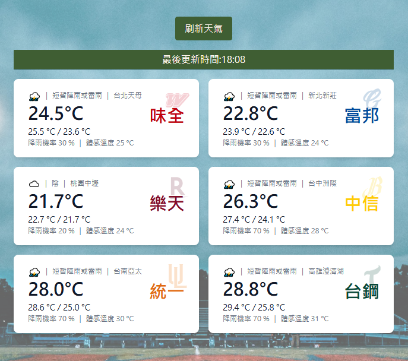

# 球場天氣小工具

因為常常看到大家在球賽前詢問「今天可以打嗎？」「今天會不會延賽？」「現場天氣如何？熱不熱？」之類的問題，再加上自己也會在看球前查看球場狀況，乾脆就動手做一個小工具。

這個作品透過中央氣象署公開資料，練習製作各棒球主場的即時天氣查詢，希望能在幾秒鐘內整理各棒場的即時天氣，除了方便自己查天氣之外，也順便練習 API 串接、資料處理以及前端開發技術 ☁️🌦️

🔗 **Live Demo**：https://chia-zz.github.io/weather-practice/



---

## ✨ 功能 Features

- 涵蓋中職 6 支球隊主場（味全 / 富邦 / 樂天 / 中信 / 統一 / 台鋼），一鍵取得各球場即時天氣
- 每張球場卡片顯示所在地、溫度、最高／最低溫、降雨機率、體感溫度與天氣狀態
- 提供「刷新天氣」按鈕，可手動重新取得資料並顯示最後更新時間
- 資料載入時顯示 loading 動畫，提升使用體驗
- RWD 響應式設計，支援手機與桌機瀏覽

---

## 🛠 技術 Tech Stack

- **React 19** + **Vite** — 前端框架與開發／打包工具
- **Tailwind CSS v4** — 樣式與 RWD 排版
- **axios** — 串接 RESTful API
- **dayjs** — 時間格式處理
- **react-loader-spinner** — 載入動畫

---

## 🌐 資料來源 Data Source

天氣資料取自 [中央氣象署開放資料平臺](https://opendata.cwa.gov.tw/)，使用前需自行至平臺註冊並申請 API 授權碼（API Key），填入 `.env` 的 `VITE_API_BASE_KEY`。

---

## 🚀 本機執行 Getting Started

```bash
# 1. clone 專案
git clone https://github.com/chia-zz/weather-practice.git
cd weather-practice

# 2. 安裝套件
npm install

# 3. 設定環境變數
#    在專案根目錄建立 .env 檔，填入中央氣象署的 API 設定
#    （變數名稱需與程式碼讀取的一致）
#    VITE_API_BASE_URL=https://opendata.cwa.gov.tw/api/v1/rest/datastore
#    VITE_API_BASE_KEY=你的中央氣象署 API 授權碼

# 4. 啟動開發伺服器
npm run dev
```

開啟瀏覽器前往終端機顯示的網址（預設 http://localhost:5173）即可瀏覽。

---

## 📦 部署 Deployment

本專案已設定 `gh-pages` 部署腳本，可一鍵發佈到 GitHub Pages：

```bash
npm run deploy
```

> 若部署後畫面空白，請確認 `vite.config.js` 的 `base` 已設為 `'/weather-practice/'`。

---

## 📁 專案結構 Project Structure

```
weather-practice/
├── public/          # 靜態資源
├── src/             # 原始碼（元件、API 串接、樣式等）
├── index.html
├── vite.config.js
└── package.json
```
